# GYM_System

GYM_System 是一个面向自助健身室场景的全栈管理系统，围绕会员管理、场地预约、课程报名、健身商城、订单管理和后台运营形成完整业务闭环，并将 AI Agent 作为系统的自然语言业务入口。

系统采用前后端分离架构，后端基于 Spring Boot，前端基于 Vue 3，并扩展了独立的 Python AI Agent 服务。AI Agent 负责理解用户输入、识别业务意图、调用会员、场地、课程、商品和订单等业务工具，并在关键信息缺失时引导用户补充，在修改业务记录前提示用户确认，让传统管理系统具备对话式查询、流程办理和多轮交互能力。

项目既适合作为 Java Web 全栈课程设计、毕业设计和企业级管理系统练习项目，也可以继续扩展为真实健身房、小型工作室或校园健身室的运营管理平台，并进一步增强 AI Agent 在业务编排、知识问答和运营辅助中的作用。

## 系统预览

### 会员资料

会员登录后可以查看账号状态、基础资料、身体数据和健身目标。系统会根据会员启用状态控制可访问功能。

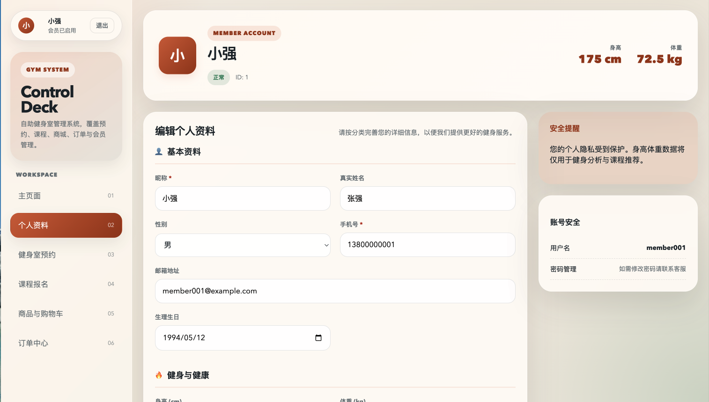

### 健身室预约

预约中心支持查看可预约房间、选择时间段、填写人数和备注，并在同一页面查看个人预约记录。

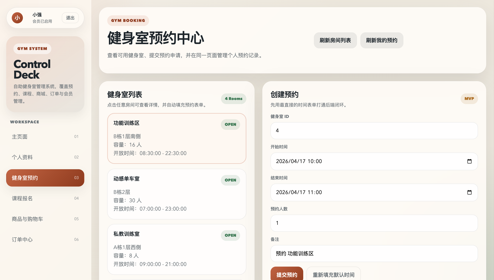

### 课程报名

课程模块提供课程列表、课程详情、报名状态和我的课程管理能力，会员可以根据课程类型、教练、场地和剩余名额选择报名。

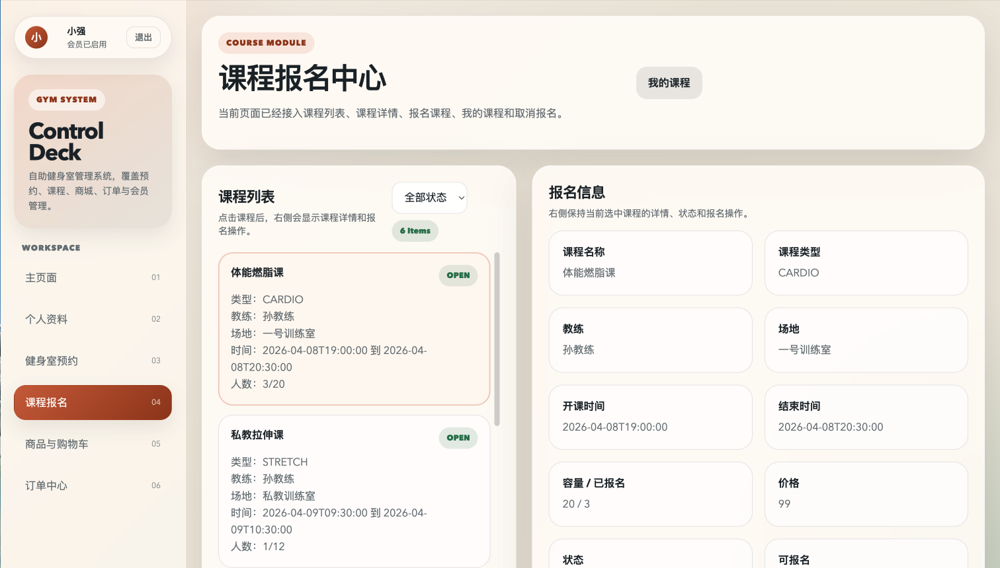

### 健身商城

商城模块覆盖商品浏览、商品详情、加入购物车、修改购物车和创建订单等流程。

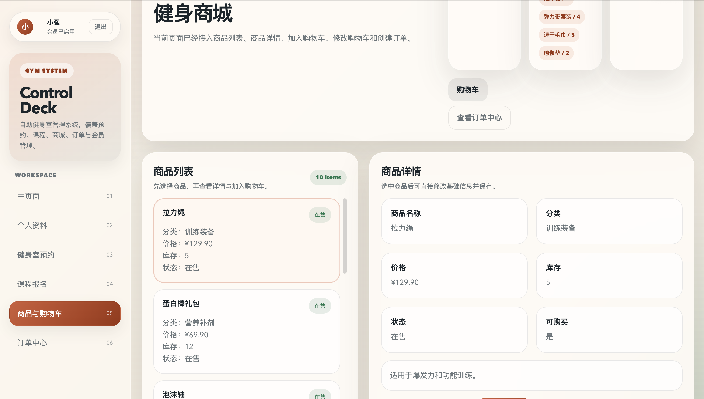

### 订单中心

订单中心展示会员订单概览、订单状态、订单详情和商品明细，便于完成商品业务链路的最后一环。

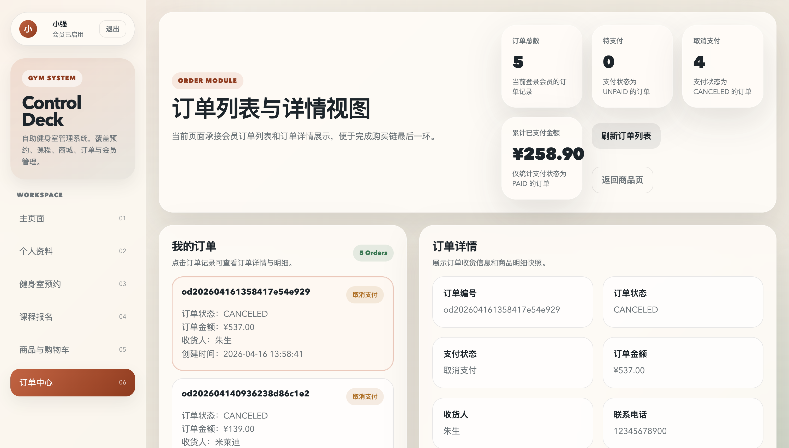

### 智能助手

智能助手支持自然语言业务操作，可以把会员查询、场地预约、课程报名、商品订单和知识问答串联成对话式流程。用户不需要手动跳转多个页面，只需要输入自然语言指令，智能助手会结合当前登录用户、会话历史和业务数据，完成意图理解、工具选择、参数补全、确认提示和结果反馈。

智能助手的执行流程强调真实业务落地：

- 先理解用户意图，判断是信息查询、预约、报名、商品流程还是知识问答。
- 再调用会员、场地、课程、商品、购物车、订单或知识库工具获取业务数据。
- 对会修改业务记录的操作生成确认提示，用户确认后再提交。
- 通过时间锚点解析“今天、明天、昨天”等相对日期，减少预约类操作的歧义。
- 保留多轮对话上下文，支持连续补充商品数量、课程名称等关键参数。

#### 对话入口与能力说明

智能助手入口提供新会话、历史对话区域和指令输入框，并说明支持的业务范围。

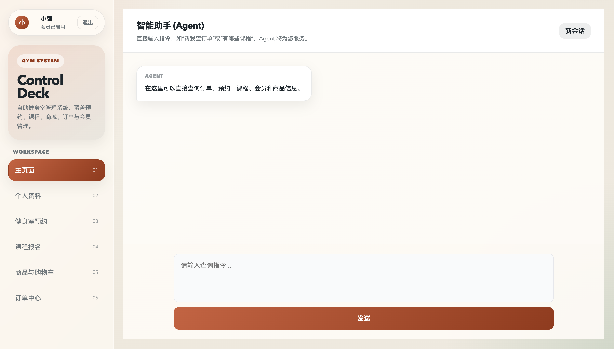

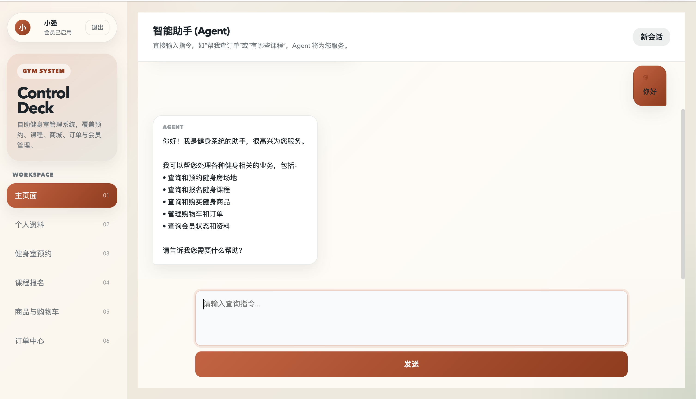

#### 会员信息查询

智能助手可以根据当前登录用户查询会员资料、账号状态、身体数据和训练目标，适合快速确认用户身份与会员状态。

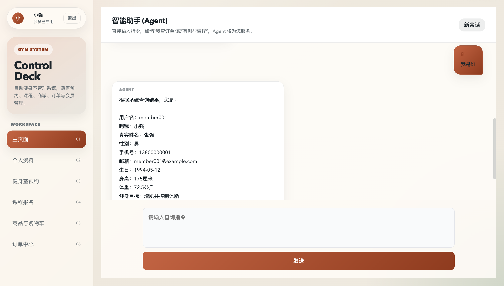

#### 健身室查询与预约

智能助手可以查询可预约健身室，根据用户输入的日期、时间段和人数生成预约草稿，并在用户确认后提交预约。

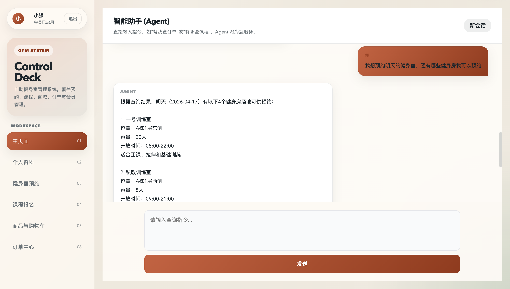

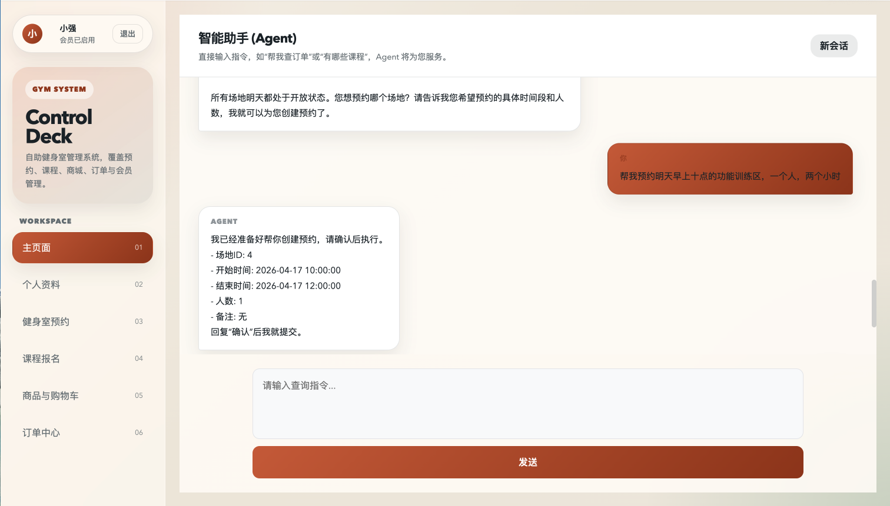

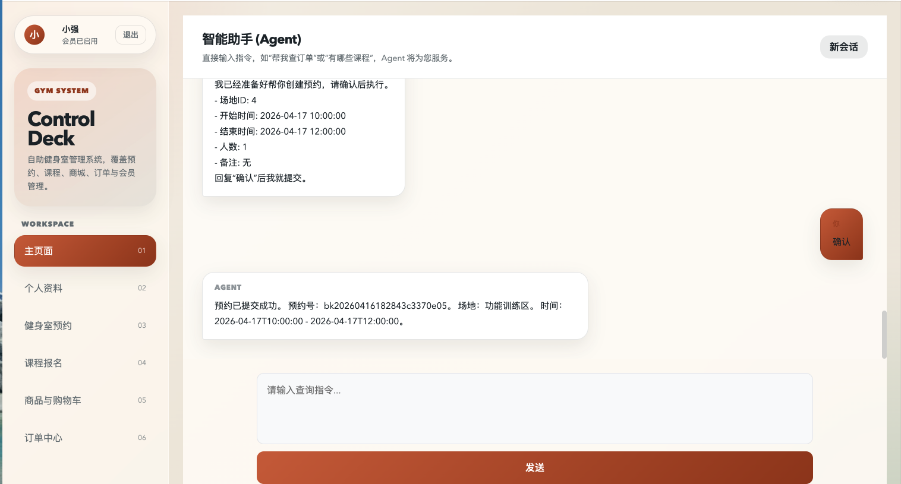

#### 课程查询与报名

智能助手可以查询当前可报名课程，展示课程类型、教练、时间、地点和剩余名额，并支持根据课程名称或课程编号完成报名。

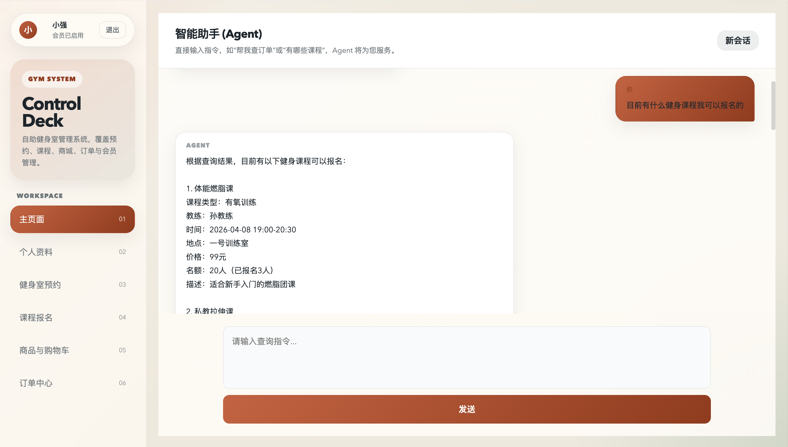

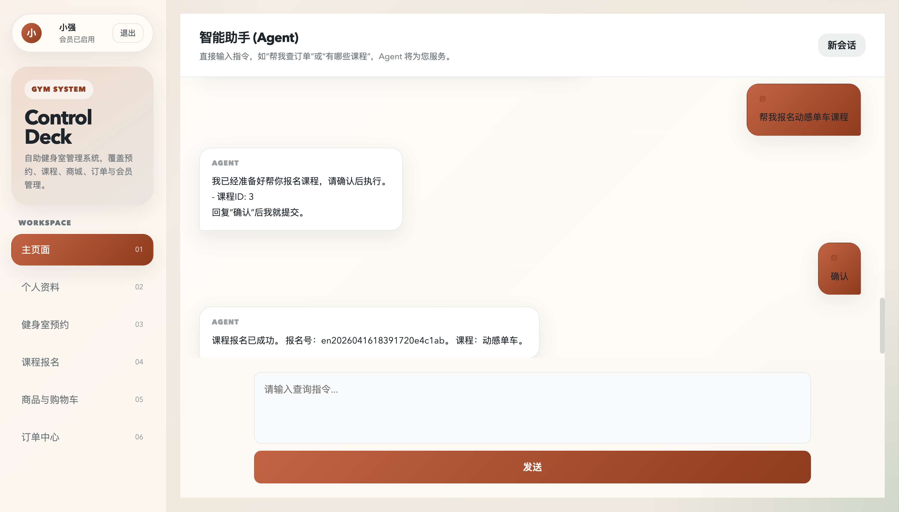

#### 商品查询与订单创建

智能助手可以查询商品信息，收集必要的配送资料，生成订单确认信息，并在用户确认后创建商品订单。

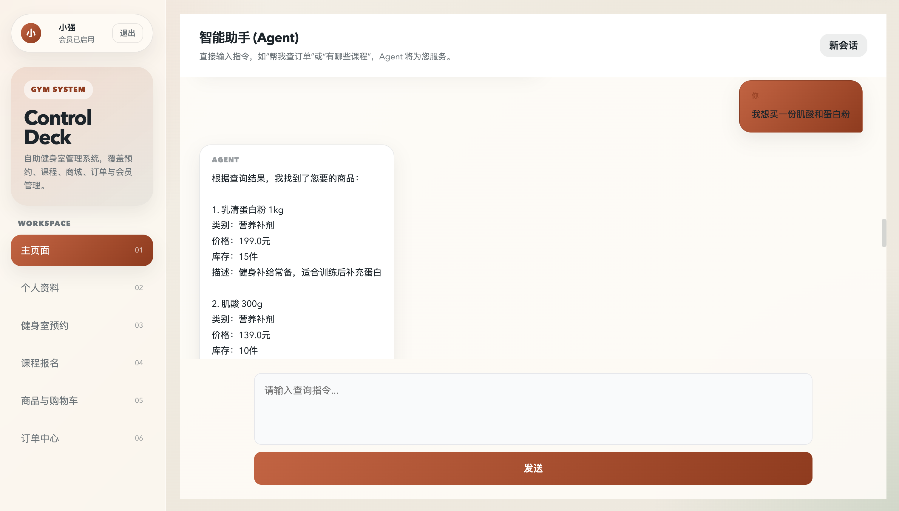

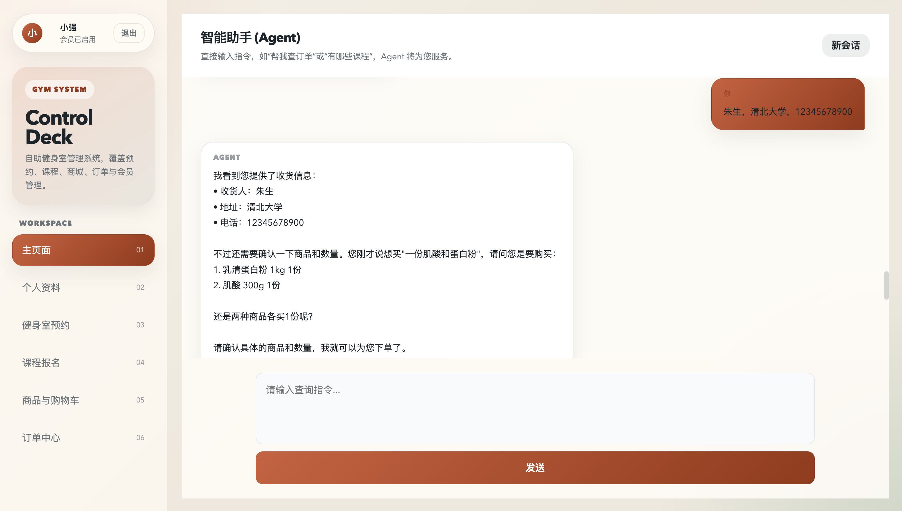

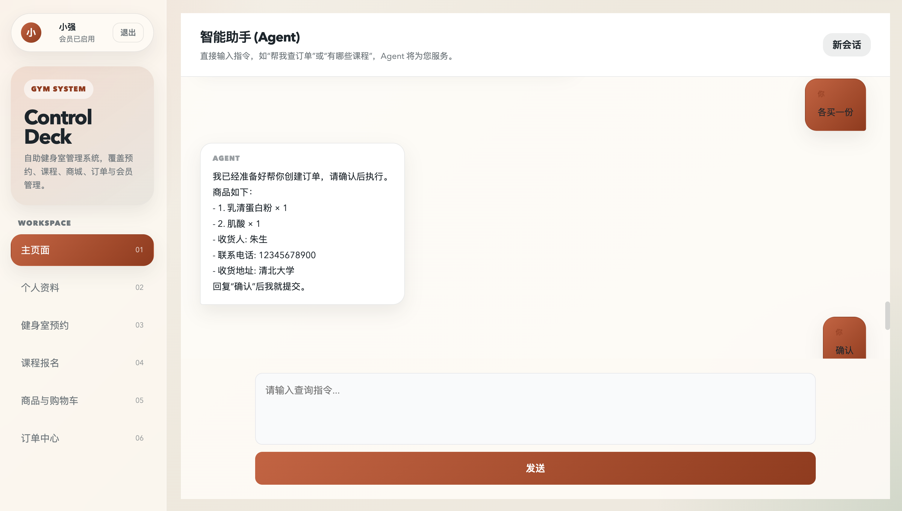

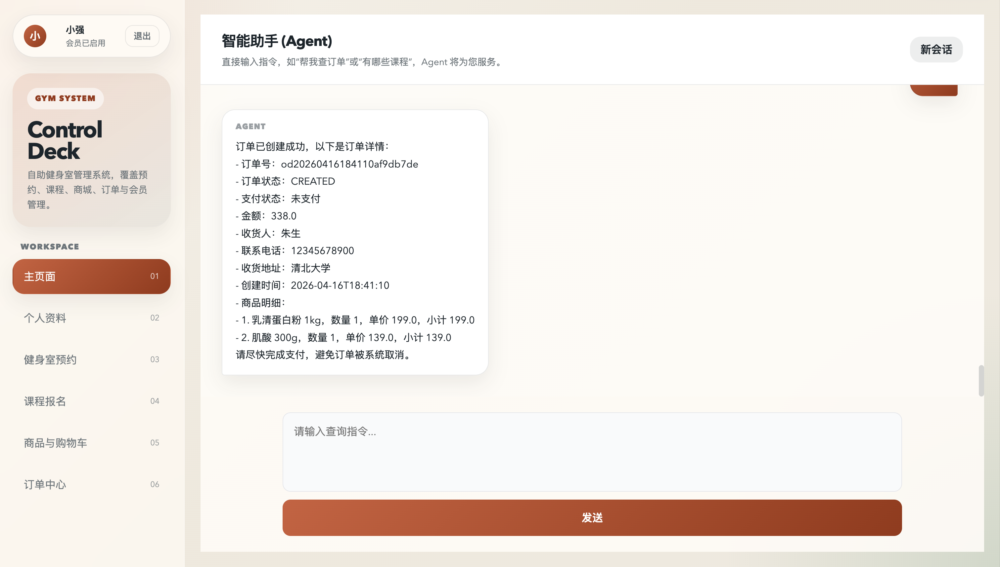

## 核心功能

### 会员端

- 会员注册、登录和退出登录
- 查看和维护个人资料
- 健身室列表查询、详情查看和预约提交
- 我的预约记录查询与管理
- 课程列表、课程详情、课程报名和报名记录管理
- 商品浏览、购物车管理和订单创建
- 订单列表、订单详情和订单状态查看
- 智能助手自然语言查询与业务办理

### 管理员端

- 会员列表查询、详情查看和资料维护
- 会员账号状态管理
- 健身室管理，包括新增、编辑、启用和停用
- 课程管理，包括新增、编辑、上下架和报名管理
- 商品管理，包括新增、编辑、上下架和库存调整
- 员工管理和器械管理
- 预约、订单等业务数据管理

### 智能助手

- 支持自然语言意图识别，覆盖查询、预约、报名、商品流程和知识问答等场景
- 聚合会员、课程、场地、商品、购物车、订单和知识库工具
- 支持查询会员资料、账号状态、课程、场地、商品库存、购物车和订单信息
- 支持场地预约、课程报名、购物车维护和商品订单创建等业务动作
- 支持多轮会话上下文，能够连续收集缺失参数
- 支持业务修改前确认机制，先生成确认提示，用户确认后再提交
- 支持时间语义锚点，将相对日期表达解析为明确日期
- 支持知识库问答，可检索会员规则、场馆说明、器械说明和运营资料等内容
- 后端通过统一网关转发智能助手请求

## 智能助手能力

系统扩展了独立的 Python 智能助手服务，用于把自然语言输入转换为业务查询和流程办理。

智能助手支持：

- 根据用户输入识别业务意图
- 查询会员、场地、课程、商品和订单相关信息
- 引导用户补充缺失信息
- 在修改业务记录前提示用户确认
- 结合知识库资料回答常见问题
- 通过后端网关与主系统业务模块协作

该设计让用户可以用对话方式完成常见业务操作，同时保留后端系统对业务规则和数据流程的统一管理。

## 技术栈

### 后端

- Java 21
- Spring Boot 3
- MyBatis
- MySQL
- Redis
- Spring Validation
- Spring Security Crypto
- Maven

### 前端

- Vue 3
- Vite
- Vue Router
- Pinia
- 原生 CSS

### 智能助手服务

- Python
- FastAPI
- 对话编排
- 业务工具调用
- 知识库检索
- 缓存和会话辅助

## 系统架构

```text
用户浏览器
   |
   |-- Vue 前端
   |      |
   |      |-- HTTP API
   |
Spring Boot 后端
   |
   |-- 业务数据存储
   |-- 缓存与会话辅助
   |-- 智能助手网关
          |
          |-- Python 智能助手服务
                 |-- 对话编排
                 |-- 业务工具调用
                 |-- 知识库检索
                 |-- 会话上下文
```

架构上，Spring Boot 后端仍然是认证、权限和核心业务流程的主系统；Python 智能助手作为智能编排层负责理解用户语言、选择工具、组织多轮对话和生成回复。这样既能突出智能交互能力，也避免智能助手绕过已有业务规则。

## 目录结构

```text
GYM_System
├── src/                         # Spring Boot 后端源码
│   └── main/
│       ├── java/com/example/gym  # 后端业务模块
│       └── resources/            # 配置文件、静态资源和 SQL 脚本
├── frontend/                     # Vue 3 前端项目
├── Agent/                        # Python 智能助手服务
├── images/                       # 项目截图资源
├── docker-compose.yml            # 本地基础服务编排
├── pom.xml                       # Maven 配置
└── README.md
```

## 后端模块说明

| 模块 | 说明 |
| --- | --- |
| `auth` | 会员登录、管理员登录、注册、当前用户、退出登录 |
| `member` | 会员个人资料和管理员会员管理 |
| `gym` | 健身室、预约记录、管理员场地管理 |
| `course` | 课程列表、课程报名、我的课程、管理员课程管理 |
| `commodity` | 商品列表、商品详情、管理员商品管理 |
| `cart` | 购物车添加、查询、修改和删除 |
| `order` | 订单创建、订单列表、订单详情和定时任务 |
| `employee` | 管理员员工管理 |
| `equipment` | 管理员器械管理 |
| `agent` | 后端到 Python 智能助手服务的网关 |
| `common` | 统一响应、异常处理、过滤器和公共工具 |

## 数据库设计

数据库脚本位于：

```text
src/main/resources/sql/schema.sql
```

主要数据表包括：

| 表名 | 说明 |
| --- | --- |
| `member` | 会员信息 |
| `admin` | 管理员信息 |
| `employee` | 员工和教练信息 |
| `gym_room` | 健身室信息 |
| `equipment` | 健身器械信息 |
| `gym_booking` | 健身室预约记录 |
| `course` | 课程信息 |
| `course_enrollment` | 课程报名记录 |
| `commodity` | 商品信息 |
| `cart_item` | 购物车明细 |
| `commodity_order` | 商品订单 |
| `commodity_order_item` | 商品订单明细 |
| `ai_session` | 智能助手会话 |
| `ai_message` | 智能助手消息 |

## 环境要求

- JDK 21+
- Maven 3.9+
- Node.js 18+
- npm
- Docker / Docker Compose
- MySQL
- Redis
- Python 3.10+，仅启动智能助手服务时需要

## 快速开始

### 1. 克隆项目

```bash
git clone <repository-url>
cd GYM_System
```

### 2. 启动基础服务

```bash
docker compose up -d
```

### 3. 初始化数据库

```bash
mysql -uroot -p gym_system < src/main/resources/sql/schema.sql
```

如果数据库不存在，也可以直接在 MySQL 客户端中执行 `schema.sql` 文件。

### 4. 启动后端

```bash
./mvnw spring-boot:run
```

后端默认地址：

```text
http://localhost:8080/api
```

### 5. 启动前端

```bash
cd frontend
npm install
npm run dev
```

前端默认地址：

```text
http://localhost:5173
```

### 6. 启动智能助手服务

```bash
cd Agent
cp .env.example .env
python start_agent.py
```

智能助手服务默认地址：

```text
http://localhost:8000
```

## 默认账号

系统支持自动初始化默认管理员账号，相关配置位于：

```text
src/main/resources/application.yaml
```

公开部署时，请通过环境变量修改默认管理员账号信息。

## 主要接口

后端统一接口前缀：

```text
/api
```

| 接口前缀 | 说明 |
| --- | --- |
| `/auth` | 认证、注册、当前用户、退出登录 |
| `/members/me/profile` | 会员个人资料 |
| `/admin/members` | 管理员会员管理 |
| `/gym/rooms` | 健身室查询 |
| `/gym/bookings` | 健身室预约 |
| `/admin/gym/rooms` | 管理员健身室管理 |
| `/courses` | 课程查询、报名和课程管理 |
| `/commodities` | 商品查询 |
| `/admin/commodities` | 管理员商品管理 |
| `/cart/items` | 购物车 |
| `/orders` | 订单 |
| `/admin/employees` | 管理员员工管理 |
| `/admin/equipments` | 管理员器械管理 |
| `/chat` | 智能助手入口 |

## 配置说明

后端主要配置文件：

```text
src/main/resources/application.yaml
src/main/resources/application-local.yaml
```

常用后端配置包括服务端口、数据库连接、缓存连接、智能助手服务地址和默认管理员信息。

智能助手配置示例位于：

```text
Agent/.env.example
```

常用智能助手配置包括服务端口、模型服务地址、知识库参数、缓存连接、后端服务地址和数据库连接。

## 业务规则

- 会员注册后默认处于待启用状态。
- 未启用会员可以登录，但可访问功能会受到限制。
- 课程报名、健身室预约和个人资料功能需要会员启用后才能使用。
- 管理员可以启用或禁用会员账号。
- 商品订单创建后会进入待处理状态，系统包含定时扫描任务。
- 智能助手对预约、报名、订单创建等业务修改操作会先给出确认提示，用户确认后再执行真实业务提交。
- 智能助手会携带当前登录用户和认证信息调用业务工具，不直接绕过后端权限和业务规则。

## 开发建议

- 不要提交本地私有配置、运行缓存、构建产物和依赖目录。
- 公开到代码托管平台前，请检查配置文件中是否包含真实数据库连接信息、访问凭据或本机绝对路径。
- 建议将本地敏感配置改为环境变量，或提供示例配置文件。
- 如果需要部署到服务器，建议拆分前端构建、后端服务、数据库、缓存和智能助手服务。
- 如果需要对外开源，请补充许可证文件。

## 项目亮点

- 覆盖会员端和管理员端，业务模块完整。
- 后端模块划分清晰，包含认证、会员、预约、课程、商城、购物车、订单和智能助手网关。
- 前端页面围绕实际业务流程设计，支持会员状态限制和角色路由控制。
- 接入 Python 智能助手服务，通过自然语言完成查询和业务办理。
- 智能助手支持意图识别、业务工具调用、多轮上下文、时间语义解析和确认后执行。
- 支持数据库、缓存、知识库和智能助手服务协作，具备继续扩展本地模型、知识库和运营记录的基础。
- 提供 Docker Compose 快速启动本地基础服务环境。

## 后续可扩展方向

- 增加真实业务结算链路
- 增加课程签到、预约核销和门禁联动
- 增加管理员数据看板和运营统计
- 增加文件上传和商品图片管理
- 增加接口文档
- 增加单元测试、集成测试和持续集成流程
- 将智能助手的工具调用流程做成可视化记录

## 许可证

当前项目尚未声明开源许可证。正式公开前请根据使用场景选择合适的许可证，或保留所有权利。
